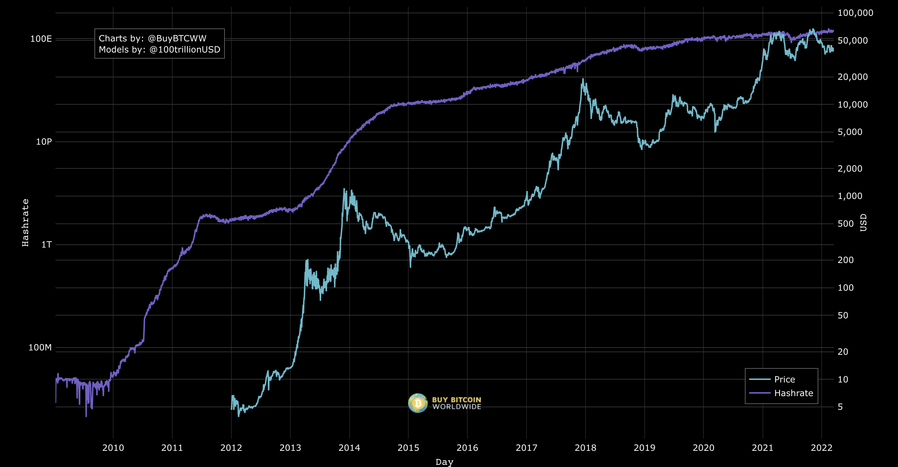

# Using Bitcoin to create a truly decentralized stablecoin

Today we'd like to present a wild idea: a Bitcoin-backed stablecoin that isn't pegged to any fiat currency. Instead of using any traditional oracle methods, it uses Bitcoin's hash rate to calculate the "purchasing power" of Bitcoin.

By not pegging this stablecoin to any fiat-based price, this would be based on the "true" purchasing power of Bitcoin. In a world where fiat currencies are being debased at an alarming rate, this idea is designed to function in a world where Bitcoin is the monetary standard.

In this post we'll outline the problems related to current pegged stablecoins, how this idea could be implemented, and why Stacks is the only chain where this idea could exist.

## What would this look like?

At launch, the stablecoin would be pegged to x% of Bitcoin’s value. Whenever Bitcoin’s difficulty increases or decreases, the value of this stablecoin would shift in the opposite direction. When difficulty increases, the value of one stablecoin decreases. When difficulty decreases, the stablecoin becomes more valuable. This allows the stablecoin to remain at a more “stable” value without being pegged to any fiat currencies.

As an example:

1. At some point in time, 100 of these stablecoins can be redeemed for 1 BTC
2. Difficulty increases 10%, which is loosely correlated with a price increase of BTC
3. Now, it takes 110 stablecoins to redeem 1 BTC

## Problems with today's pegged stablecoins

Ideally, stablecoins allow users to hold an asset that maintains a constant purchasing power. Most crypto assets have high price volatility, which limits the utility of their use as a medium of exchange.

Today's stablecoins aim to solve this problem by pegging their value to a specific asset or a basket of assets. More specifically, the vast majority of stablecoins are pegged to the US dollar. Unfortunately, with high inflation and dollar debasement, the actual purchasing power per USD is in a constant decline.

### Even "decentralized" stablecoins have other problems

Additionally, the design of "decentralized" stablecoins present further problems. They rely on some form of collateral to backstop the system - but these collateral types are not as strong as Bitcoin when it comes to resilience as a monetary asset.

They also rely on some form of a price oracle to maintain the mechanism that keeps their stablecoin pegged. These oracles are prone to centralization and have proven to be major risk factors for many projects.

This raises the question - is there a way to build a stablecoin that overcomes these flaws?

## Dampened Bitcoin

We're presenting a solution that utilizes all of the great research and development of today's decentralized stablecoins, but uses Bitcoin's difficulty as the "source of truth" for the value of the collateral in the system.

The concept of a "dampened" asset was popularized by [Reflexer](https://reflexer.finance/), the DAO behind the RAI stablecoin. They aim to solve the problems of fiat-pegged assets that we described above. To understand how RAI works, check out their [explainer](https://medium.com/reflexer-labs/stability-without-pegs-8c6a1cbc7fbd) .

Our design tweaks the RAI model with two variations:

1. Using Bitcoin's difficulty metric as an oracle
2. Using Bitcoin (instead of ETH) as collateral

In effect, you can think of the "value" of this stablecoin as a stable unit of Bitcoin's difficulty. An increase in difficulty is correlated with an increase in Bitcoin's value. When difficulty increases, the value of this stablecoin would decrease in relation to Bitcoin. A decrease in difficulty would increase the market price of our stablecoin in relation to Bitcoin. In effect, this "dampens" the volatility of Bitcoin's price, allowing Bitcoiners to hold an asset with a more constant purchasing power.

## Stacks is the perfect chain for dampened Bitcoin

If we had to pick the one "super power" of Stacks, it's that Stacks smart contracts can trustlessly read Bitcoin block headers in Clarity contracts. No other chain can do this (without oracles), and this is due to the unique nature of how Stacks is built on top of Bitcoin. We've already seen how this super power can be used for trustless swaps based on Bitcoin transactions in apps like [Catamaran Swaps](https://www.catamaranswaps.org/), [LNSwap](https://www.lnswap.org/), and [Magic](https://www.magic.fun/).

Our idea utilizes Bitcoin block headers for a different and novel use: reading Bitcoin's current difficulty. In the block header are four bytes that are a compact representation of the current "difficulty target" (or `nBits`).

**Stacks is the only smart contract chain that can read this data trustlessly**. Even Bitcoin's scripting language doesn't have a way of executing logic based on the current difficulty.

On top of this super power, Stacks has the same smart contract abilities that are required to support the complex mechanism designs required to implement a full DeFi protocol around this idea.

## Challenges

As exciting as this idea is, there are a few challenges to be solved before turning it into a reality.

### Difficulty is a lagging indicator

The design of Bitcoin's difficulty is not 100% correlated with the market price, or purchasing power, of Bitcoin. Difficulty changes based on the total miner hash rate, but hash rate will never be perfectly reflective of price. Mining Bitcoin requires a large up-front investment of capital, and miners expect some amount of profit from their endeavors. Because of this, there will likely never be a perfect correlation between hash rate and time.

Additionally, it's rare to see hash rate drop, even in Bitcoin bear markets. This goes back to the nature of mining requiring up-front capital - once a mining rig is bought, your only marginal cost is electricity. Bitcoin miners are typically long-term bullish on Bitcoin, so they'd rather steadily acquire more BTC, even if the marginal cost of electricity is more than their revenue at current prices.

For these reasons, some even believe that hash rate is a **leading indicator**. In the chart below, we see that hash rate increases even as the market price of BTC is decreasing.

Unlike hash rate, Bitcoin's difficulty is not a constantly-changing number. Bitcoin's consensus mechanism only updates difficulty every 2016 blocks - roughly every two weeks. This adjustment is made by measuring the time it took to create those 2016 blocks. If it took less than two weeks, difficulty is increased, and vice-versa. A protocol on Stacks could compare block intervals in its "oracle" to more dynamically estimate the current hash rate.

Building a stablecoin around hash rate will therefore likely contain more short-term volatility than a pegged stablecoin. This won't be ideal for all consumers, but for Bitcoiners who value decentralization and "hard money", this design should fit their needs.

### Bitcoin collateral

Although Stacks already has the capabilities needed to measure hash rate, using Bitcoin as collateral on Stacks is still an area of research. As of today, Stacks has xBTC, which is a centralized "wrapped" Bitcoin asset. In a protocol where decentralization is a core value, this is likely insufficient.

Luckily, there are areas of research where this can be improved. One potential solution is to create a "stablecoin" pegged to Bitcoin's value, much like some other synthetic assets. [BIPs 300 and 301](https://www.drivechain.info/) aim to support native and trustless transferring of Bitcoin to other chains and back. Hopefully, Stacks could be a chain that supports this when those BIPs are implemented.

---

We think that building a stablecoin that isn't pegged to any fiat currencies is a critical solution for a world where Bitcoin is the standard monetary asset. By using difficulty as a trustless measure of Bitcoin's purchasing power, we can eliminate the need for oracles as a dependency. Although this design comes with challenges, this is exactly the type of innovation that we at Mechanism hope to bring into the world.
